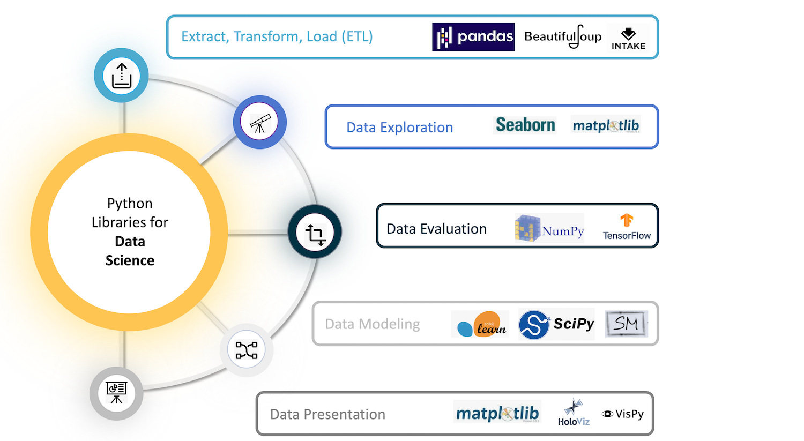

# TCC para o curso de DataScience - UVV

Este repositório é dedicado ao projeto de conclusão de curso para o curso de Ciência de Dados da Universidade Vila Velha - UVV.

---
\
**Título:** UWine – Clube de Vinhos da UVV.

A proposta do projeto consiste na análise de um Clube de Vinhos universitário fictício, com base em dados simulados, que será totalmente orientado por técnicas e práticas de Ciência de Dados.

**Autor:** Rodrigo Lopes

# Navegação
- [Cenário fictício](#cenário-fictício)
    - [Metodologia do projeto](#metodologia-do-projeto)
- [Desenvolvimento](#desenvolvimento)
    - [A1: ETL (Extract, Transform, Load)](#a1-etl-extract-transform-load)
        - [A1.1: Determinar o tamanho da Amostra](#a11-determinar-o-tamanho-da-amostra)
        - [A1.2: Analisar os outliers](#a12-analisar-os-outliers)
        - [A1.3: Testes de hipóteses](#a13-testes-de-hipóteses)
    - [A2: Data Exploration](#a2-data-exploration)
        - [A2.1: Analisar as variáveis Quantitativas](#a21-analisar-as-variáveis-quantitativas)
        - [A2.2: Analisar as variáveis Qualitativas](#a22-analisar-as-variáveis-qualitativas)
    - [A3: Data Evaluation](#a3-data-evaluation)
        - [A3.1: Discretizar a Variável Qualitativa (OPINIÃO DO CLIENTE)](#a31-discretizar-a-variável-qualitativa-opinião-do-cliente)
        - [A3.2: Análise Bootstrap do resultado da Pesquisa de Satisfação](#a32-análise-bootstrap-do-resultado-da-pesquisa-de-satisfação)
        - [A3.3: Resultado Final da Pesquisa de Satisfação](#a33-resultado-final-da-pesquisa-de-satisfação)
    - [A4: Data Modeling](#) (WIP)
    - [A5: Data Presentation](#) (WIP)


# Cenário fictício

Você foi designado como Consultor em Ciência de Dados ( Data Science Consultant ) para fazer uma análise completa dos dados dos clientes a partir de um conjunto de dados (Amostra) com mais de 1 milhão de notas fiscais (~ 350 Megabytes). Além disso, há uma entrada diária de aproximadamente umas 5000 novas notas fiscais no sistema.

O objetivo é permitir que cada consultor(a) percorra foco analíticos diferentes dentro do mesmo ecossistema de dados, aplicando modelos de machine learning supervisionado ou não supervisionado, análise preditiva, dashboards interativos, entre outros.

Para garantir organização, profundidade técnica e coerência metodológica no desenvolvimento do Projeto UWine, adotaremos um workflow composto por cinco etapas principais, alinhadas às boas práticas da Ciência de Dados. Cada etapa representa um marco do processo analítico, permitindo que cada analista avance de forma estruturada do entendimento inicial dos dados até a entrega final dos insights.

## Metodologia do projeto

Será adotada uma convenção de nomeclatura das etapas necessárias para conclusão do projeto, sendo:
- A1: ETL (Extract, Transform, Load)
- A2: Data Exploration
- A3: Data Evaluation
- A4: Data Modeling
- A5: Data Presentation

# Desenvolvimento

O projeto é realizado utilizando o VSCode com Plugin do Jupyter. \
Foi adotada uma estrutura de modularização, separando o código por resolução de etapas.

## A1: ETL (Extract, Transform, Load)

**Objetivo:** Obter, preparar e organizar os dados para análise.

Nesta fase será realizada a extração e carregamento para o ambiente de análise (como Python + Jupyter). Apesar da base ser fornecida, será necessário compreender sua estrutura e aplicar as transformações adequadas, como:

Extração (Extract): Acesso à fonte de dados. \
Transformação (Transform): Limpeza, tratamento de valores nulos, padronização de tipos e formatação dos dados. \
Carregamento (Load): Inserção dos dados em estruturas compatíveis com os algoritmos e visualizações, como Ndarray + DataFrames.

**Ferramentas sugeridas:** Pandas, NumPy, Statsmodel.

### A1.1: Determinar o tamanho da Amostra

1. Code...
```py
import bla
print(result)
```

### A1.2: Analisar os outliers

1. Code...
```py
import bla
print(result)
```

### A1.3: Testes de hipóteses

1. Code...
```py
import bla
print(result)
```

## A2: Data Exploration

**Objetivo:** Obter, preparar e organizar os dados para análise.

Com os dados preparados, deverá ser realizada uma análise exploratória (EDA - Exploratory Data Analysis) para compreender distribuições, correlações, valores discrepantes e tendências. Isso inclui:

- Estatísticas descritivas (média, mediana, desvio padrão);
- Visualizações iniciais (histogramas, paretos, boxplots, scatter plots);
- Análise de correlação entre variáveis (heatmaps, matrizes);
- Verificação de anomalias ou inconsistências;

Essa etapa é crucial para gerar os Teste de Hipóteses Analíticas nos próximos passos.

### A2.1: Analisar as variáveis Quantitativas

1. Code...
```py
import bla
print(result)
```

### A2.2: Analisar as variáveis Qualitativas

1. Code...
```py
import bla
print(result)
```

## A3: Data Evaluation

**Objetivo:** Avaliar a qualidade dos dados e a relevância das variáveis.

Nesta etapa, o foco é validar o potencial analítico dos dados e selecionar as variáveis mais relevantes para os objetivos do problema. Algumas ações envolvem:

- Realização dos Teste de Hipóteses Analíticas;
- Avaliação da qualidade dos dados (completude, consistência, precisão);
- Seleção de features importantes (feature selection);
- Balanceamento de classes (para modelos supervisionados);
- Preparação dos dados para modelagem (normalização, encoding).

A partir daqui, os dados devem estar prontos para alimentar modelos e testes mais robustos.

**Ferramentas sugeridas:** Scikit-learn, Statsmodel, seaborn.

### A3.1: Discretizar a Variável Qualitativa (OPINIÃO DO CLIENTE)

1. Code...
```py
import bla
print(result)
```

### A3.2: Análise Bootstrap do resultado da Pesquisa de Satisfação

1. Code...
```py
import bla
print(result)
```

### A3.3: Resultado Final da Pesquisa de Satisfação

1. Code...
```py
import bla
print(result)
```